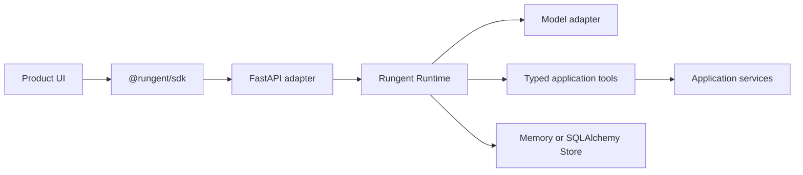
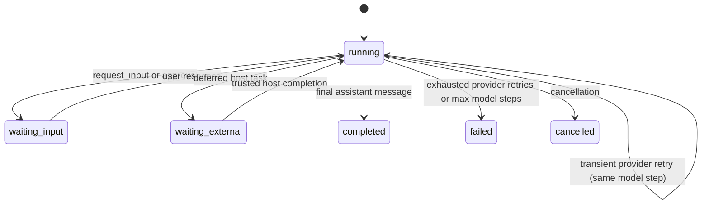

## Decision

Rungent is an embedded Python runtime with optional adapters, not an agent platform. The host
application owns authentication, business services, database transactions, prompts, tools, and UI.
Rungent owns the model/tool loop and its externally observable lifecycle.

This boundary gives Roasea direct, typed access to its existing services without a sidecar network
hop or duplicated authorization model. A sidecar can be added later as another transport only when
multiple processes or languages genuinely need the same runtime.

## Standardized lifecycle

A session has at most one active Run. The entire Run keeps one monotonic ACS event sequence across
pause/resume boundaries. Approvals persist a validated, normalized tool invocation; resuming cannot
substitute new arguments. A deferred task persists its host task ID and original tool call;
completion is trusted, terminal, and consumable exactly once.

## Packages

| Package | Responsibility |
| --- | --- |
| `rungent` | Agent definition, `@tool`, loop, interactions, ACS, model/store ports |
| `rungent.fastapi` | Four resource-oriented endpoints and SSE transport |
| `rungent.sqlalchemy` | Application-owned persistent store |
| `rungent.testing` | deterministic harness tests and real-model application baselines |
| `@rungent/sdk` | headless stream parser, client, and reducer |
| `@rungent/docs` | human docs plus `/llms.txt`, `/llms-full.txt`, raw Markdown routes |

## Deliberate omissions

- No sidecar until an actual cross-process consumer requires it.
- No skill router; begin with one product Agent and normal typed tools.
- No styled chat component; Roasea keeps its design system and renders the headless state.
- No provider-specific event types in the browser.
- No prompt-based safety decisions where deterministic runtime policy can enforce them.
- No automatic production schema creation; migrations remain application-owned.

Add a new abstraction only after two real integrations need the same boundary.
