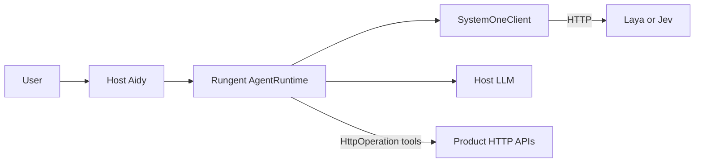
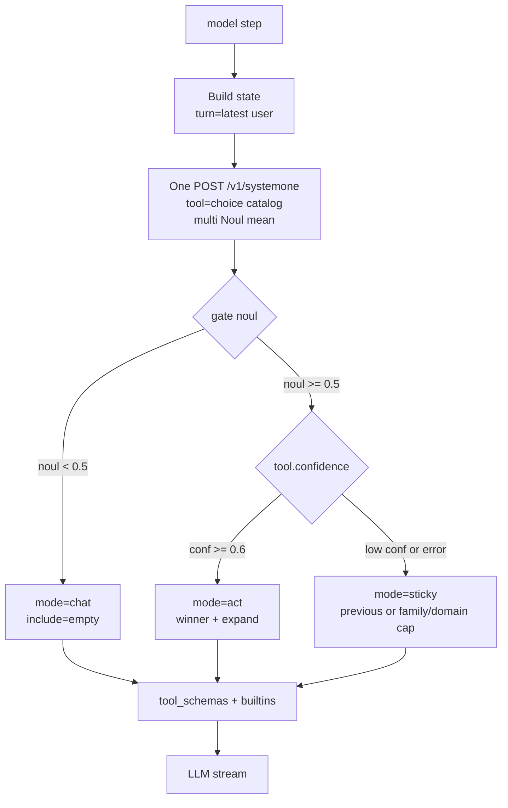
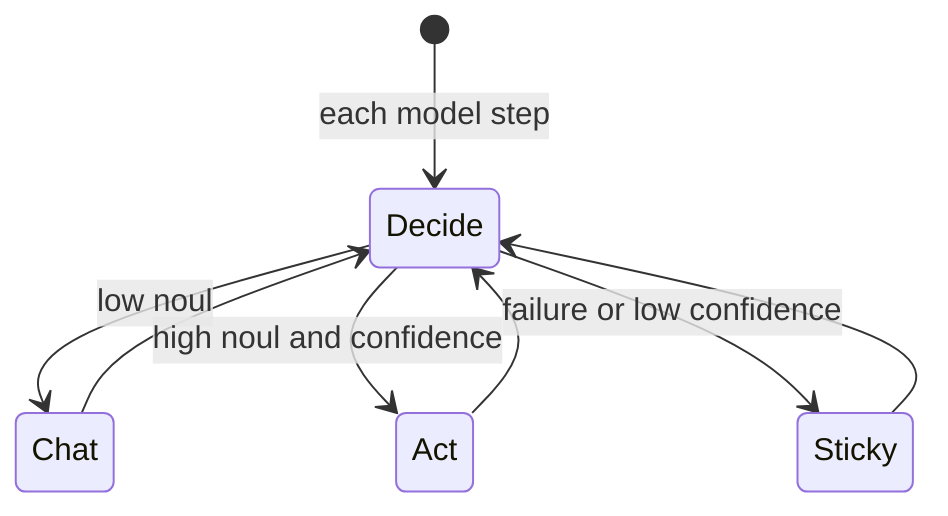

# System One (Jev-compatible)

Rungent shortlists tools **each model step** with a System One decision endpoint
(TypeSafe [Jev](https://thejevai.com/docs) wire protocol; production typically uses in-cluster
**Laya**). The control layer follows the
[Jev agent harness](https://learnjev.com/tutorials/agent-harness): Noul decides whether any tool
is needed; Choice picks which operation fits. Code owns permissions and fail-soft policy.

Hosts plug in with `SystemOneSettings.from_env()` only — no product-specific shortlist code in the
library, and no System One policy modules in the host.

## Role

- **Does:** decide chat vs act; pick one best operation; expand via `domain` / name tokens / optional `family` metadata.
- **Does not:** fill arguments, write prose, replace `approval="always"`, or enforce RBAC.

## Contract (one evaluate per step)

```text
state = {
  turn: <latest user text>,
  recent_tools: [...],
  focus: <focus ids>,
  pending: <optional interaction summary>,
}
questions = {
  tool: choice over the full business catalog (name → description),
  needs_tool / acts_on_resources / prose_suffices: product-neutral Nouls,
}
gate = max(needs_tool, acts_on_resources, 1 - prose_suffices)
```

| Condition | Mode | `include` (business tools) |
| --- | --- | --- |
| `gate < threshold` (default 0.5) | `chat` | empty — builtins only |
| gate ≥ threshold and tool `confidence` ≥ threshold (default 0.6) | `act` | winner ∪ family/domain expand, capped by `max_tools` |
| transport failure or low confidence | `sticky` | previous step include, else family/domain cap — **never** the full catalog |

Builtins (`request_input`, `report_progress`) are always attached by `Agent.tool_schemas`.

**Expand (deterministic):** optional `Tool.family` / `HttpOperation.family` groups draft-style
workflows; otherwise same `domain` plus shared name tokens. Hosts set family as **data** on tools.

## Configure

```python
from rungent import SystemOneSettings, create_openapi_runtime

runtime = create_openapi_runtime(
    ...,
    systemone=SystemOneSettings.from_env(),  # SYSTEMONE_BASE_URL required
)
```

| Env | Default | Meaning |
| --- | --- | --- |
| `SYSTEMONE_BASE_URL` | (required) | Laya / Jev base; trailing `/v1` stripped |
| `SYSTEMONE_MODEL` | `multilingual` | Decision model id |
| `SYSTEMONE_API_KEY` | — | Bearer for the endpoint |
| `SYSTEMONE_TIMEOUT_SECONDS` | `5` | HTTP timeout |
| `SYSTEMONE_NEEDS_TOOL_THRESHOLD` | `0.5` | Below → `chat` |
| `SYSTEMONE_CONFIDENCE_THRESHOLD` | `0.6` | Below → `sticky` |
| `SYSTEMONE_MAX_TOOLS` | `8` | Cap for `act` / `sticky` |

Logs each step: `mode`, `noul`, `choice`, `confidence`, `include_size`.

## OpenAPI tool source

Prefer a thin host config (`sources` + `include` + `overrides`) loaded with
`load_operations_from_config` / `load_allowlist_file`. Specs come from in-cluster OpenAPI URLs
(or snapshot files for offline tests). Tool **execution** still uses the host loopback base URL.

## Diagrams

### Components



### Per model step



### Modes



## Security

Pass structured `state` fields (`turn`, `recent_tools`, `focus`, `pending`). Do not concatenate
untrusted tool output into question instructions. Keep permissions, path allowlists, and spend
caps in host code — System One advises; the runtime enforces.

## Anti-patterns

- Domain intermediate round then a second HTTP call for tools (catalogue fits in one Choice ≤255).
- Low noul or low confidence → **full allowlist** (that inverts the harness and disables shortlisting).
- Freezing `state.turn` to the original `run.input` instead of the latest user message.
- Treating empty business `include` as a bug; `chat` mode intentionally exposes builtins only.
- Baking product language or draft name regexes into the library harness.
